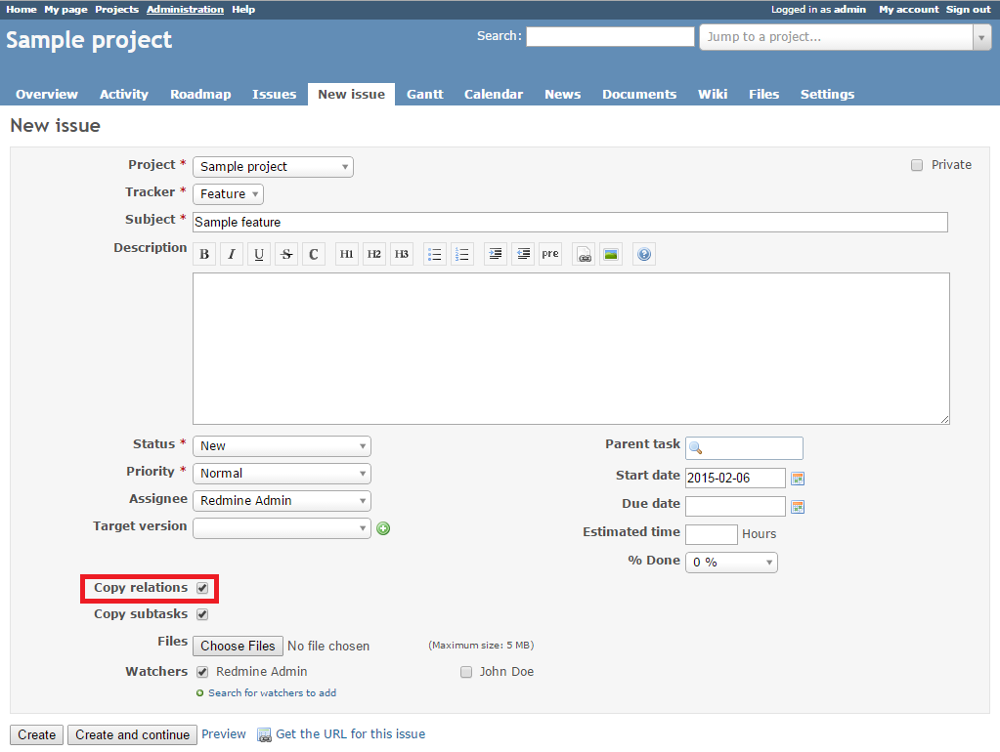
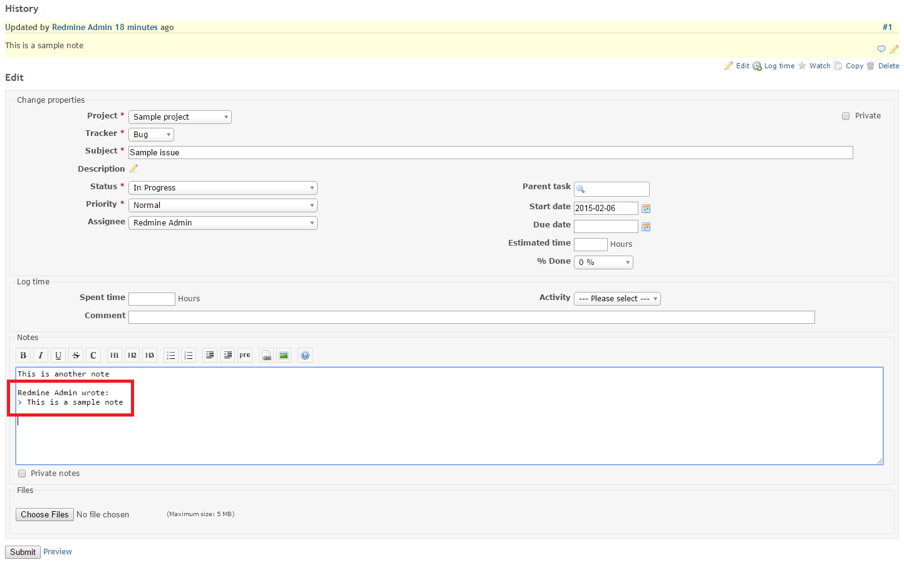

# Redmine Customization Plugin

This plugin provides a number of useful features for Redmine customization.

* This plugin enables other plugins to override the existing Redmine translations.
* The Redmine administrator can set a custom account approval notice text and add top menu links.
* Users can create custom buttons and collapse sidebar blocks.
* The plugin makes the selector in filters larger.
* The 'Jump to a project' box has an improved design and shows all projects.
* Users can get a URL for a new issue draft.
* When an issue is copied, watchers and related issues are copied as well.
* Quotes are inserted at the cursor position in the issue note.
* Users can submit issues by pressing Command+Enter.
* The plugin shows attached file descriptions in the issue history.
* The plugin highlights notes accessed by direct links.
* The plugin fixes a Redmine error related to incorrect display of issues with a shared target version.
* The plugin adds a sibling section to issue show page. 

## Compatibility

This plugin version is compatible only with Redmine 3.x and later.

## Installation

This plugin requires Redmine Select2 Plugin to be installed.

1. To install the plugins
    * Download the .ZIP archives, extract files and copy the plugin directories into #{REDMINE_ROOT}/plugins.
    
    Or

    * Change you current directory to your Redmine root directory:  

            cd {REDMINE_ROOT}
            
      Copy the plugins from GitHub using the following commands:
      
            git clone https://github.com/Restream/redmine__select2.git plugins/redmine__select2
            git clone https://github.com/Restream/redmine_customize.git plugins/redmine_customize
            
2. Install the required gems using the command:  

        bundle install  

    * In case of bundle install errors, remove the Gemfile.lock file, update the local package index and install the required dependencies. Then execute the `bundle install` command again:  

            rm Gemfile.lock
            sudo apt-get update
            sudo apt-get install -y libxml2-dev libxslt-dev libpq-dev
            bundle install
            
3. These plugins require a migration. Run the following command to upgrade your database (make a database backup before):  

        bundle exec rake redmine:plugins:migrate RAILS_ENV=production

4. Restart Redmine.

Now you should be able to see the plugins in **Administration > Plugins**.

## Usage

### Override Redmine Translations

The Redmine Customization Plugin enables other plugins to override the existing translations with custom localized strings. This is possible due to the patch to **Redmine::I18n::Backend** which allows loading Redmine core locale files before the plugin locale files.

### Customize Account Approval Notice Text

The plugin enables the Redmine administrator to set a custom text for the account approval pending notice.

To do this, go to **Administration > Redmine customize settings**, enter the text in the corresponding field in the **Account approval notice** section and click **Apply**.  
  

### Create Top Menu Links

The plugin enables the Redmine administrator to add links to the top menu in Redmine.

To add a link to the top menu, go to **Administration > Redmine customize settings**.  
 

In the **Top menu links** section, click **Add**.  Enter the link text, URL and title (optional) and click **Apply**.  

Now the link will be displayed at the top menu in Redmine.  

### Create Custom Buttons

The plugin enables Redmine users to add and configure their own buttons to update issues. The Redmine Administrator can also create buttons for all users (public buttons).

To add a custom button, go to **My account** and click **Manage custom buttons for issue pages** in the **Custom buttons** section.  

Then click **New custom button**.  

Specify the button name, select an icon and configure the button as needed.  

In the **Show in the following cases** section, specify the cases when the button should be displayed. You can select to show the button in certain projects, for certain trackers, issue statuses, categories, authors, assignees and roles. 

To hide the button if the values it is supposed to change are already set, select the **Hide the button if no changes can be made** check box.

In the **New values for the issue** section, select the target values that should be set when the button is clicked.

Click **Save** to create the button.

Now the button will be displayed on the issue page.

To edit or delete a custom button, click **My account** and then click **Manage custom buttons for issue pages**.  

### Collapse Sidebar Blocks

The plugin enables users to collapse and expand certain sidebar blocks using the **plus/minus** controls.  

The plugin saves the preferred selection for future sessions.

### Enlarge Filter Selectors

The plugin enables users to collapse and expand the selectors in issue filters using the **plus/minus** controls.

### Improve Jump to Project Box 

This plugin improves the design of the **Jump to a project** box and makes it display all projects.  

### Create Issue Drafts

The plugin enables users to create an issue draft with pre-filled attributes, and get its URL without the need to save the issue.

To create the issue draft and get its URL, click **Get the URL for this issue**

In the pop-up window, copy the URL in the **URL for this form** field and click **OK**. This URL can be sent to other users who will make the necessary changes and save the issue.

### Create Exact Issue Copies

When a user makes a copy of an issue, the plugin ensures that the issue watchers are copied as well The user can also enable the **Copy relations** check box to copy the related issues.  

### Insert Quotes Safely

The plugin enables users to insert quotes directly at the cursor position in the issue note without replacing the text they may have already added.

### Submit Issues Quickly

The plugin enables users to submit an issue by pressing Command+Enter (Ctrl+Enter in Windows and Linux) on the issue form page. 

### Show Attachment Descriptions in Issue Notes

The plugin shows the descriptions of the attached files in the issue history.

### Highlight Notes in Issue History

The plugin highlights a note in the issue history when it is accessed by a direct link ((.../issues/XXX#note-YYY)

### Fix Shared Version Issue

The plugin fixes a Redmine error when issues with a [shared target version](http://www.redmine.org/projects/redmine/wiki/RedmineProjectSettings#Versions) are not displayed correctly on the version overview page. 

*This was fixed in Redmine 2.6.*

### Hide public projects for specific users

The plugin can hide public projects for specific users. 

## Maintainers

Danil Tashkinov, [github.com/nodecarter](https://github.com/nodecarter)

## License

Copyright (c) 2017 Restream

Licensed under the Apache License, Version 2.0 (the "License");
you may not use this file except in compliance with the License.
You may obtain a copy of the License at

http://www.apache.org/licenses/LICENSE-2.0

Unless required by applicable law or agreed to in writing, software
distributed under the License is distributed on an "AS IS" BASIS,
WITHOUT WARRANTIES OR CONDITIONS OF ANY KIND, either express or implied.
See the License for the specific language governing permissions and
limitations under the License.
